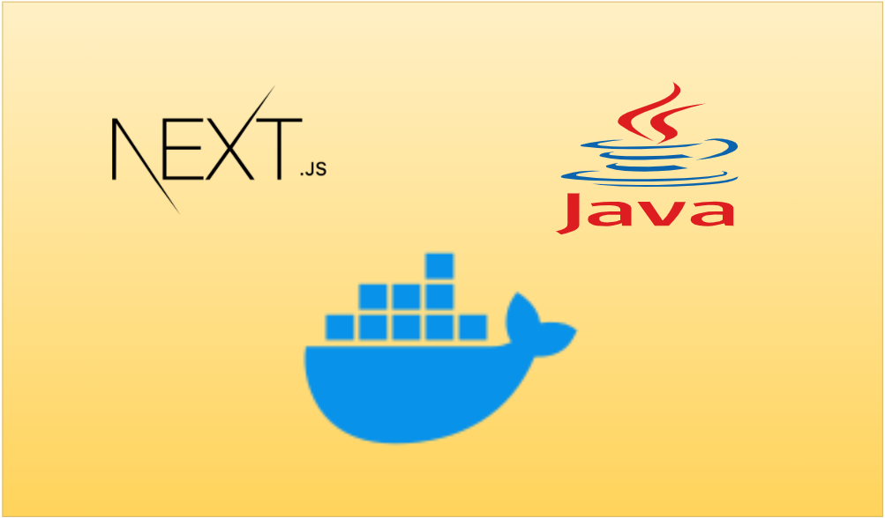

# Java e Next.js: Uma Dupla Dinâmica



Embora React e Next.js sejam a estrela do seu texto sobre gerenciamento de estado, Java e Next.js podem formar uma dupla dinâmica para desenvolvimento web full-stack. Aqui está uma releitura com um toque Java:
Amor à Primeira API (Java)

Nossa história começa com um desenvolvedor Java apaixonado pela criação de APIs robustas e escaláveis. Essas APIs, cheias de potencial, prometem fornecer dados e funcionalidades para a aplicação web.
Java
```
// API Java (Exemplo)
@RestController
public class ApiController {

  @GetMapping("/dados")
  public List<Produto> getProdutos() {
    // Busca dados de produto do banco
  }
}
```
Use o código com cuidado.
Next.js Entra em Cena: A Interface Brilhante

Enquanto isso, um outro desenvolvedor se apaixona por Next.js, um framework Javascript para construir interfaces de usuário modernas e performáticas. Next.js é perfeito para consumir as APIs Java e dar vida aos dados com componentes reutilizáveis.
JavaScript
```
// Next.js consumindo API Java (Exemplo)
async function getProdutos() {
  const response = await fetch("http://localhost:8080/dados");
  return await response.json();
}
function PaginaProdutos() {
  const [produtos, setProdutos] = useState([]);

  useEffect(() => {
    const fetchData = async () => {
      const data = await getProdutos();
      setProdutos(data);
    };
    fetchData();
  }, []);

  return (
    <ul>
      {produtos.map((produto) => (
        <li key={produto.id}>{produto.nome}</li>
      ))}
    </ul>
  );
}
```

Use o código com cuidado.
Cooperação é a Chave

Ao invés de brigar pelo controle (como no caso do drama de prop drilling), Java e Next.js trabalham juntos. A API Java fornece dados confiáveis, enquanto Next.js constrói uma interface atraente e dinâmica.
Final Feliz: Aplicação Full-Stack

Com Java cuidando da lógica e Next.js tratando da apresentação, a aplicação web prospera. Dados fluem perfeitamente entre as camadas, resultando em uma experiência de usuário rica e satisfatória.
Moral da História

Java e Next.js, embora de linguagens diferentes, podem ser ótimos parceiros para construir aplicações web robustas e escaláveis. Aproveite o poder de cada um para criar soluções completas e eficientes.